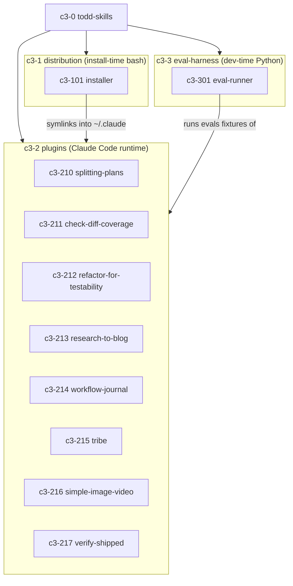

## Goal

Adopt C3 architecture documentation for **todd-skills**: create a validated `.c3/` topology — 3 containers matching the repo's 3 runtime boundaries (install-time shell distribution, Claude-Code-runtime plugins, dev-time Python eval harness), 10 components, 3 cross-cutting refs, 2 coding rules — with code-map coverage so any file path resolves to its owning component via `c3x lookup`, and inject a CLAUDE.md pointer so future agents route architecture work through `/c3`.

## Context

| Arg | Value |
| --- | --- |
| PROJECT | todd-skills — Todd Lam's personal Claude Code plugin marketplace |
| GOAL | Package personal Claude Code agents & skills as installable plugins, keep the repo the single source of truth via symlink installs, and benchmark each skill/agent with a repo-wide eval harness |
| SUMMARY | A local plugin marketplace bundling 8 plugins (agents + skills), a symlink installer, and a with/without-skill eval harness that shells out to claude -p |

**Current state:** no architecture docs exist. Knowledge lives in scattered READMEs (`plugins/tribe/README.md`, `scripts/evals/README.md`), the installer's header comment, and dated spec/plan/evidence files under `docs/superpowers/`. Nothing maps files to owners, and conventions (plugin layout, evals.json shape, bash strict mode) are enforced only by imitation.

**Abstract constraints (system-level non-negotiables):**

- The repo is the single source of truth: installs are symlinks, never copies (`install.sh` header states this explicitly).
- Installs are idempotent; conflicting targets are backed up (`.bak.<epoch>`), never destroyed.
- Eval fixtures (`evals/`) are dev tooling, never runtime content — intentionally not symlinked into `~/.claude`.
- Definition of Done for tribe-delivered work: PR squash-merged, master in sync, worktree removed (encoded in the `verify-shipped` plugin).

**Container inventory (Stage 0):**

| N | CONTAINER_NAME | BOUNDARY | GOAL | SUMMARY |
| --- | --- | --- | --- | --- |
| 1 | distribution | install-time bash tooling on the dev machine | Register plugins and link them into ~/.claude | .claude-plugin/marketplace.json manifest + install.sh symlink installer with per-plugin post-install hooks |
| 2 | plugins | Claude Code runtime (~/.claude/agents, ~/.claude/skills) | Provide the 8 installable agent/skill plugins | splitting-plans, check-diff-coverage, refactor-for-testability, research-to-blog, workflow-journal, tribe, simple-image-video, verify-shipped |
| 3 | eval-harness | dev-time Python harness spawning isolated claude -p subprocesses | Benchmark skills/agents with-vs-without the skill under test | scripts/evals/run_evals.py executing plugins/**/evals/evals.json fixtures into graded benchmark.json |

**Component inventory (Stage 0):**

| N | NN | COMPONENT_NAME | CATEGORY | GOAL | SUMMARY |
| --- | --- | --- | --- | --- | --- |
| 1 | 01 | installer | Foundation | Symlink plugins into ~/.claude idempotently | install.sh + marketplace manifest; backs up conflicts, runs plugin post-install hooks |
| 2 | 10 | splitting-plans | Feature | Split monolithic plans into parallel sub-plans | Skill + lock validator script + evals |
| 2 | 11 | check-diff-coverage | Feature | Measure uncovered diff vs main, drive remediation | Skill + measure.sh (.NET/Go) + references + evals |
| 2 | 12 | refactor-for-testability | Feature | Reshape untestable code before changing behavior | Skill + evals |
| 2 | 13 | research-to-blog | Feature | Turn insights/topics into bilingual research posts | Single agent definition |
| 2 | 14 | workflow-journal | Feature | Export Workflow runs to Markdown, auto-capture via Stop hook | Skill + wf-export.py + hooks.json + install hook |
| 2 | 15 | tribe | Feature | 5-agent chain-of-command delivery system | Agents (shaman/warchief/hunter/tracker/skinner) + heartbeat/resume/plan-validator scripts + script tests + agent-flavored evals + CLAUDE.md snippet |
| 2 | 16 | simple-image-video | Feature | Animate one still image into a seamless looping video | Skill + Remotion template + assemble/calibrate/setup scripts |
| 2 | 17 | verify-shipped | Feature | Mechanically verify the tribe Definition of Done | Skill + verify-shipped.sh (4 checks against git/GitHub) |
| 3 | 01 | eval-runner | Foundation | Run evals.json cases in isolated claude -p subprocesses and grade them | run_evals.py: with_skill vs --safe-mode baseline, stream-json metrics, grader call, benchmark.json rollup |

**Ref inventory (Stage 0):**

| SLUG | TITLE | GOAL | Scope | Applies To |
| --- | --- | --- | --- | --- |
| plugin-layout | Plugin directory contract | One predictable shape per plugin so installer and evals can walk it | plugins/*/ | all 8 plugins + installer |
| evals-fixture | evals.json fixture shape | One eval format so a single runner benchmarks every skill/agent | plugins/**/evals/evals.json | plugins with evals + eval-runner |
| docs-lifecycle | Dated spec/plan/evidence docs | Feature work leaves dated specs, plans, and evidence under docs/superpowers/ | docs/superpowers/** | repo-wide delivery workflow |

**Rule inventory (Stage 0):**

| SLUG | TITLE | GOAL | Scope | Applies To |
| --- | --- | --- | --- | --- |
| bash-strict-mode | Bash strict mode everywhere | Every shell script fails fast and loud | **/*.sh | all shell scripts (verified: 0 violations today) |
| marketplace-registration | Marketplace registration required | Every plugin directory is discoverable and installable | plugins/*, .claude-plugin/marketplace.json | installer + all plugins |

**Overview diagram (topology as adopted):**

## Decision

Document the repo as **3 containers matching its 3 genuine runtime boundaries** rather than mirroring the directory tree: (1) `distribution` — bash that runs at install time on the dev machine; (2) `plugins` — content that runs inside Claude Code sessions after being symlinked into `~/.claude`; (3) `eval-harness` — Python that runs at dev time and spawns isolated `claude -p` subprocesses. Each of the 8 plugins becomes one Feature component inside `plugins` (they share a lifecycle and layout but own independent business logic); the installer and the eval runner are Foundation components in their own containers. Shared conventions become 3 refs; the two verifiable repo-wide standards become rules wired to the components they bind. Code-map globs cover every tracked file, with tests/fixtures handled per component globs.

## Affected Topology

| Entity | Type | Why affected | Governance review |
| --- | --- | --- | --- |
| c3-0 | system | Context doc created with system goal and constraints | c3x check schema pass |
| c3-1 | container | New container README + membership | c3x check + component/parent consistency |
| c3-2 | container | New container README + membership (8 components) | c3x check + component/parent consistency |
| c3-3 | container | New container README + membership | c3x check + component/parent consistency |
| c3-101 | component | New Foundation doc + codemap for install.sh, manifest | cites plugin-layout, bash-strict-mode, marketplace-registration |
| c3-210 | component | New Feature doc + codemap | cites plugin-layout, evals-fixture, bash-strict-mode |
| c3-211 | component | New Feature doc + codemap | cites plugin-layout, evals-fixture, bash-strict-mode |
| c3-212 | component | New Feature doc + codemap | cites plugin-layout, evals-fixture |
| c3-213 | component | New Feature doc + codemap | cites plugin-layout |
| c3-214 | component | New Feature doc + codemap | cites plugin-layout, bash-strict-mode |
| c3-215 | component | New Feature doc + codemap | cites plugin-layout, evals-fixture, docs-lifecycle, bash-strict-mode |
| c3-216 | component | New Feature doc + codemap | cites plugin-layout, bash-strict-mode |
| c3-217 | component | New Feature doc + codemap | cites plugin-layout, bash-strict-mode |
| c3-301 | component | New Foundation doc + codemap for scripts/evals/** | cites evals-fixture |

## Compliance Refs

| Ref | Why required | Action |
| --- | --- | --- |
| ref-plugin-layout | The installer walks exactly this directory shape and every plugin must conform to be installable | create-ref |
| ref-evals-fixture | run_evals.py parses exactly this JSON shape; four plugins ship fixtures in it | create-ref |
| ref-docs-lifecycle | Feature delivery in this repo leaves dated spec/plan/evidence files; future ADRs should link them | create-ref |

## Compliance Rules

| Rule | Why required | Action |
| --- | --- | --- |
| rule-bash-strict-mode | All 14 tracked .sh files already comply (grep -L 'set -euo pipefail' returns none); the rule locks the standard in | create + comply |
| rule-marketplace-registration | marketplace.json currently lists all 8 plugins/* directories; an unregistered plugin would be silently uninstallable via marketplace flows | create + comply |

## Work Breakdown

| Area | Detail | Evidence |
| --- | --- | --- |
| Scaffold | c3x init created .c3/ with c3-0 and this ADR | .c3/ exists in worktree |
| Containers | c3x add container × 3 with Goal/Components/Responsibilities bodies | c3x list shows c3-1..c3-3 |
| Components | c3x add component × 10 (2 Foundation, 8 Feature) with Goal + Dependencies bodies | c3x list counts |
| Refs | c3x add ref × 3 with Goal/Choice/Why bodies | c3x read ref-* |
| Rules | c3x add rule × 2 with Goal/Rule/Golden Example bodies | c3x read rule-* |
| Wiring | c3x wire components → refs/rules per Affected Topology table | c3x graph citations |
| Code-map | c3x set <id> codemap globs; spot-check c3x lookup install.sh, c3x lookup 'plugins/**' | lookup output |
| CLAUDE.md | Append # Architecture pointer block to repo CLAUDE.md | file diff |
| Delivery | Commit on c3-onboard branch, PR, squash-merge, sync master, remove worktree | gh pr view merged state |

## Underlay C3 Changes

| Underlay area | Exact C3 change | Verification evidence |
| --- | --- | --- |
| N.A - onboarding uses the stock packaged c3x CLI | N.A - no C3 commands, validators, schemas, templates, hints, or tests are modified by adopting docs | N.A - c3x --version unchanged; only .c3/ content is created |

## Enforcement Surfaces

| Surface | Behavior | Evidence |
| --- | --- | --- |
| c3x check | Validates schema completeness, wiring, codemap integrity, canonical sync on every future mutation | clean run before merge |
| c3x lookup <file> | Maps any touched file to its owning component + binding refs/rules before edits | spot-checks in Verification |
| CLAUDE.md # Architecture block | Routes future agents to /c3 for queries/changes/audits so docs stay current | block present in repo CLAUDE.md |
| rule-bash-strict-mode golden example | Tracker-style reviews diff new .sh files against the rule | rule doc exists, cited by shell-bearing components |

## Alternatives Considered

| Alternative | Rejected because |
| --- | --- |
| Plain ARCHITECTURE.md prose doc | Nothing validates it; no file→owner lookup; it would drift exactly like the knowledge already scattered across READMEs here |
| Single container for the whole repo | Collapses three different runtime boundaries (install-time bash, Claude-Code-runtime plugin content, dev-time Python harness) that change and fail independently |
| One container per plugin (8+ containers) | Plugins share one lifecycle, one layout contract, and one installer; container = runtime boundary, not directory. Per-plugin containers would add 8 READMEs with identical Responsibilities |
| Model docs/superpowers/ as a container | It is inert markdown with no runtime; a ref (docs-lifecycle) captures the convention without inventing a boundary |

## Risks

| Risk | Mitigation | Verification |
| --- | --- | --- |
| New plugin added without docs/codemap → coverage drifts | rule-marketplace-registration + CLAUDE.md routes changes through /c3; c3x check flags unmapped growth | c3x list coverage % at merge time |
| Codemap globs miss nested files (templates, references, fixtures) | Per-component plugins/<name>/** globs cover whole subtrees | c3x lookup 'plugins/**' spot-check returns owners |
| ADR tables go stale as the repo evolves | ADR is terminal-state historical once implemented; living truth is container/component docs | c3x check excludes implemented ADRs by design |
| Onboard branch conflicts with concurrent master work | Work done in dedicated worktree, PR squash-merge, master pulled first (was up to date) | PR merges clean |

## Verification

| Check | Result |
| --- | --- |
| c3x check | zero errors before commit |
| c3x list | 3 containers, 10 components, 3 refs, 2 rules; coverage reported |
| c3x lookup install.sh | resolves to installer component |
| c3x lookup plugins/tribe/agents/warchief.md | resolves to tribe component |
| c3x lookup scripts/evals/run_evals.py | resolves to eval-runner component |
| gh pr view <n> --json state,mergeCommit | state MERGED via squash |
